<div align="center">



<br>

<a href="#"></a>
<a href="#"></a>

<br>

[](https://www.linkedin.com/in/muhammad-awais-ai-engineer/)
[](https://ik-awais.github.io)
[](https://www.upwork.com/freelancers/~018a2d0e2f88ac4838)
[](mailto:mawaisqq@gmail.com)
[](mailto:m.awais@aigenmat.com)
[](https://instagram.com/ik_.awais)


> *"The measure of intelligence is the ability to change."* - Albert Einstein


</div>

##  &nbsp;About

```yaml
name:       Muhammad Awais
role:       AI Developer
current:    Operations Associate @ AI GenMat
Experience: Managing Director @ AI GenMat
location:   Islamabad, Pakistan

education:
  current:  BS Software Engineering, FAST-NUCES Islamabad (2026 - present)
  previous: BS Artificial Intelligence, FAST-NUCES Peshawar (2025 - 2026)

focus:
  - Agentic AI & Multi-Agent Systems
  - LLM Fine-tuning & RAG Pipelines
  - NLP & Computer Vision
  - GenAI & AI Automation
  - Software Engineering

languages:
  - Python
  - C++
  - C
  - TypeScript / JavaScript
  - Bash

open_to:
  - High-impact AI collaborations
  - Freelance AI systems & infrastructure
  - Research-oriented AI engineering
  - Agentic AI consulting

portfolio:  https://ik-awais.github.io
```

**Timeline**

```text
2026 - now    BS Software Engineering, FAST-NUCES Islamabad  (transferred)
2026 - now    Operations Associate, AI GenMat  (Ex-Managing Director)
2025 - 2026   BS Artificial Intelligence, FAST-NUCES Peshawar
2025 - 2026   Managing Director, AI GenMat
```

<br>

##  &nbsp;Tech Stack

<div align="center">


<br><br>


<br>


<br><br>


<br>


<br><br>


<br>


<br><br>


<br>


</div>

<br>

##  &nbsp;Featured Projects

| Project | Description | Stack |
|---|---|---|
| **[MediScan AI](https://github.com/ik-awais/Python_Projects/tree/main/PAI/Mediscan)** | End-to-end medical image analysis pipeline: fine-tuned ViT for X-ray classification, anomaly detection, and automated radiology report generation | `PyTorch` `HuggingFace` `OpenCV` `FastAPI` |
| **[AI Research Assistant](https://github.com/ik-awais/ai-research-agent)** | Multi-step agentic workflow for automated research synthesis, retrieval, and structured summarization | `LangChain` `LlamaIndex` `Python` |
| **[Document Q&A System](https://github.com/ik-awais)** | RAG-based intelligent document querying with precise, context-aware answer extraction | `LangChain` `FAISS` `FastAPI` `Python` |

<br>

##  &nbsp;GitHub Stats

<div align="center">


<br><br>


<br>

<br>

##  &nbsp;Language Stats

<div align="center">


<br>

[-006B3C?style=for-the-badge&logo=duolingo&logoColor=white)]()
[]()
[]()

</div>

<br>

##  &nbsp;Contribution Graph

<div align="center">


</div>


<div align="center">


**[ik-awais.github.io](https://ik-awais.github.io)** &nbsp;·&nbsp; **<m.awais@aigenmat.com>**


</div>
